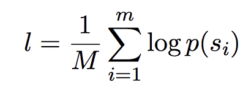

# Building a Trigram Language Model <!-- omit in toc -->

- [Introduction](#introduction)
- [Part 1: Extracting n-grams from a sentence](#part-1-extracting-n-grams-from-a-sentence)
- [Part 2: Counting n-grams in a corpus](#part-2-counting-n-grams-in-a-corpus)
  - [Reading the corpus and dealing with unseen words](#reading-the-corpus-and-dealing-with-unseen-words)
  - [Counting n-grams](#counting-n-grams)
- [Part 3: Raw n-gram probabilities](#part-3-raw-n-gram-probabilities)
  - [Generating text](#generating-text)
- [Part 4: Smoothed probabilities](#part-4-smoothed-probabilities)
- [Part 5: Computing Sentence Probability](#part-5-computing-sentence-probability)
- [Part 6: Perplexity](#part-6-perplexity)
- [Part 7: Using the Model for Text Classification](#part-7-using-the-model-for-text-classification)

## Introduction
This peoject builds a **trigram** language model in Python and the code are provided in the file `trigram_model.py`. The main component of the language model is implemented in the class TrigramModel.

One important idea behind implementing language models is that the probability distributions are not precomputed. Instead, the model only stores the raw counts of n-gram occurrences and then computes the probabilities on demand. This makes smoothing possible.

The data works with is available in the folder `data`. 

## Part 1: Extracting n-grams from a sentence
The function `get_ngrams` takes a list of strings and an integer *n* as input, and returns padded n-grams over the list of strings. The result should be a list of Python tuples. 

For example:
```python
>>> get_ngrams(["natural","language","processing"],1)
[('START',), ('natural',), ('language',), ('processing',), ('STOP',)]
>>> get_ngrams(["natural","language","processing"],2)
('START', 'natural'), ('natural', 'language'), ('language', 'processing'), ('processing', 'STOP')]
>>> get_ngrams(["natural","language","processing"],3)
[('START', 'START', 'natural'), ('START', 'natural', 'language'), ('natural', 'language', 'processing'), ('language', 'processing', 'STOP')]
```

## Part 2: Counting n-grams in a corpus
There are two different data sets in the data folder. The first data set is the Brown corpus, which is a sample of American written English collected in the 1950s. The format of the data is a plain text file `brown_train.txt`, containing one sentence per line. **Each sentence has already been tokenized. For this assignment, no further preprocessing is necessary.**

### Reading the corpus and dealing with unseen words 
The function `corpus_reader` in `trigram_model.py` takes the name of a text file as a parameter and returns a Python generator object. Generators allow to iterate over a collection, one item at a time without ever having to represent the entire data set in a data structure (such as a list). This is a form of *lazy evaluation*. We could use this function as follows: 
```python
>>> generator = corpus_reader("")
>>> for sentence in generator:
        print(sentence)

['the', 'fulton', 'county', 'grand', 'jury', 'said', 'friday', 'an', 'investigation', 'of', 'atlanta', "'s", 'recent', 'primary', 'election', 'produced', '``', 'no', 'evidence', "''", 'that', 'any', 'irregularities', 'took', 'place', '.']
['the', 'jury', 'further', 'said', 'in', 'term-end', 'presentments', 'that', 'the', 'city', 'executive', 'committee', ',', 'which', 'had', 'over-all', 'charge', 'of', 'the', 'election', ',', '``', 'deserves', 'the', 'praise', 'and', 'thanks', 'of', 'the', 'city', 'of', 'atlanta', "''", 'for', 'the', 'manner', 'in', 'which', 'the', 'election', 'was', 'conducted', '.']
['the', 'september-october', 'term', 'jury', 'had', 'been', 'charged', 'by', 'fulton', 'superior', 'court', 'judge', 'durwood', 'pye', 'to', 'investigate', 'reports', 'of', 'possible', '``', 'irregularities', "''", 'in', 'the', 'hard-fought', 'primary', 'which', 'was', 'won', 'by', 'mayor-nominate', 'ivan', 'allen', 'jr', '&', '.']
```

Note that iterating over this generator object works only once. After we are done, we need to create a new generator to do it again. 

There are two sources of data sparseness when working with language models: completely unseen words and unseen contexts. One way to deal with unseen words is to use a pre-defined lexicon before we extract n-grams. The function `corpus_reader` has an optional parameter lexicon, which should be a Python set containing a list of tokens in the lexicon. All tokens that are not in the lexicon will be replaced with a special "UNK" token.

Instead of pre-defining a lexicon, we collect one from the training corpus. This is the purpose of the function `get_lexicon(corpus)`. This function takes a corpus iterarator (as returned by `corpus_reader`) as a parameter and returns a set of all words that **appear in the corpus more than once**. The idea is that words that appear only once are so rare that they are a good stand-in for words that have not been seen at all in unseen text.

Now take a look at the `__init__` method of TrigramModel (the constructor). When a new TrigramModel is created, we pass in the filename of a corpus file. We then iterate through the corpus *twice*: once to collect the lexicon, and once to count n-grams.

### Counting n-grams
The method `count_ngrams` counts the occurrence frequencies for n-grams in the corpus. The method already creates three instance variables of TrigramModel, which store the unigram, bigram, and trigram counts in the corpus. Each variable is a dictionary (a hash map) that maps the n-gram to its count in the corpus.

For example, after populating these dictionaries, we want to be able to query
```python
>>> model.trigramcounts[('START','START','the')]
5478
>>> model.bigramcounts[('START','the')]
5478
>>> model.unigramcounts[('the',)]
61428
```

where *model* is an instance of TrigramModel that has been trained on a corpus. Note that the unigrams are represented as one-element tuples (indicated by `the ,` in the end).

## Part 3: Raw n-gram probabilities
Among the methods `raw_trigram_probability(trigram)`,  `raw_bigram_probability(bigram)`, and `raw_unigram_probability(unigram)`, each one of them should return an unsmoothed probability computed from the trigram, bigram, and unigram counts. Note that you we need to keep track of the total number of words in order to compute the unigram probabilities. 

### Generating text
The method `generate_sentence` returns a list of strings, randomly generated from the raw trigram model. We need to keep track of the previous two tokens in the sequence, starting with `("START","START")`. Then, to create the next word, look at all words that appeared in this context and get the raw trigram probability for each.

Draw a random word from this distribution and then add it to the sequence. Stop generating words once the `"STOP"` token is generated. Here are some examples for how this method behaves: 
```python
>>> model.generate_sentence()
['the', 'last', 'tread', ',', 'mama', 'did', 'mention', 'to', 'the', 'opposing', 'sector', 'of', 'our', 'natural', 'resources', '.', 'STOP']

>>> model.generate_sentence()
['the', 'specific', 'group', 'which', 'caused', 'this', 'to', 'fundamentals', 'and', 'each', 'berated', 'the', 'other', 'resident', '.', 'STOP']
```
The optional `t` parameter of the method specifies the maximum sequence length so that no more tokens are generated if the "STOP" token is not reached before *t* words. 

## Part 4: Smoothed probabilities
The method `smoothed_trigram_probability(self, trigram)` uses linear interpolation between the raw trigram, unigram, and bigram probabilities. Set the interpolation parameters to `lambda1 = lambda2 = lambda3 = 1/3`. Use the raw probability methods defined before.

## Part 5: Computing Sentence Probability
The method `sentence_logprob(sentence)` returns the log probability of an entire sequence. Use the `get_ngrams` function to compute trigrams and the `smoothed_trigram_probabilitymethod` to obtain probabilities. Convert each probability into logspace using `math.log2`. For example: 
```python
>>> math.log2(0.8)
-0.3219280948873623
```
Then, instead of multiplying probabilities, add the log probabilities. Regular probabilities would quickly become too small, leading to numeric issues, so I typically work with log probabilities instead. 

## Part 6: Perplexity
The method `perplexity(corpus)` computes the perplexity of the model on an entire corpus. Corpus is a corpus iterator (as returned by the `corpus_reader` method). 

Recall that the perplexity is defined as `2^{-l}` , where `l` is defined as: 



Here `M` is the total number of words. So to compute the perplexity, sum the log probability for each sentence, and then divide by the total number of words in the corpus.

Run the perplexity function on the test set for the Brown corpus `brown_test.txt`. The perplexity should be less than 400. Also try computing the perplexity on the training data (which should be a lot lower, unsurprisingly).

This is a form of intrinsic evaluation.

## Part 7: Using the Model for Text Classification
The final part applies the trigram model to a text classification task. I use a data set of essays written by non-native speakers of English for the ETS TOEFL test. These essays are scored according to skill level low, medium, or high. I will only consider essays that have been scored as "high" or "low". Train a different language model on a training set of each category and then use these models to automatically score unseen essays. Compute the perplexity of each language model on each essay. The model with the lower perplexity determines the class of the essay. 

The files `ets_toefl_data/train_high.txt` and `ets_toefl_data/train_low.txt` in the data folder contain the training data for high and low skill essays, respectively. The directories `ets_toefl_data/test_high` and `ets_toefl_data/test_low` contain test essays (one per file) of each category.

The method `essay_scoring_experiment` should be called by passing two training text files, and two testing directories (containing text files of individual essays). It returns the accuracy of the prediction.

The method creates two trigram models, reads in the test essays from each directory, and computes the perplexity for each essay. And then compare the perplexities and returns the accuracy (correct predictions / total predictions). 

On the essay data set, easily get an accuracy of > 80%.

