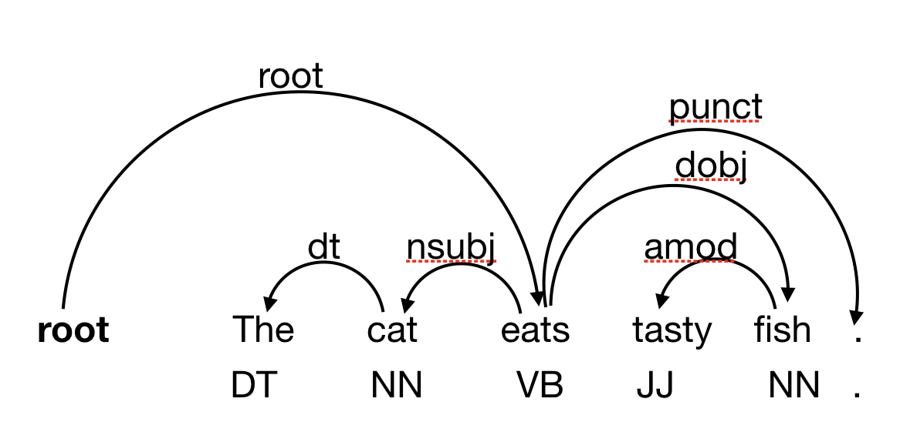

# Dependency Parsing with Neural Networks <!-- omit in toc -->

- [Introduction](#introduction)
- [Prequisites: Installing necessary packages](#prequisites-installing-necessary-packages)
  - [Installing TensorFlow and Keras](#installing-tensorflow-and-keras)
  - [Testing your Setup](#testing-your-setup)
- [Getting Started](#getting-started)
  - [Brief info about programs anda data](#brief-info-about-programs-anda-data)
  - [Dependency Format](#dependency-format)
- [Part 1: Obtaining the vocabulary](#part-1-obtaining-the-vocabulary)
- [Part 2: Extracting input/output matrices for training](#part-2-extracting-inputoutput-matrices-for-training)
  - [Implementation details](#implementation-details)
    - [Extracting input representations](#extracting-input-representations)
    - [Generating input and output matrices](#generating-input-and-output-matrices)
- [Part 3: Designing and Training the network](#part-3-designing-and-training-the-network)
  - [Implementation details](#implementation-details-1)
    - [Network topology](#network-topology)
    - [Training a model](#training-a-model)
- [Part 4: Greedy Parsing Algorithm - Building and evaluating the parser](#part-4-greedy-parsing-algorithm---building-and-evaluating-the-parser)
  - [Implementation details](#implementation-details-2)

## Introduction
This project trains a feed-forward neural network to predict the transitions of an arc-standard dependency parser. The input to this network is a representation of the current state (including words on the stack and buffer). The output is a transition (shift, left_arc, right_arc), together with a dependency relation label.

Implementations include the parser, the input representation for the neural net, decode the output of the network, and also specify the network architecture and train the model. 

As background reading for this project, it is helpful to take a look at the following paper: 

> Chen, D., & Manning, C. (2014). A fast and accurate dependency parser using neural networks. In Proceedings of the 2014 conference on empirical methods in natural language processing (EMNLP) (pp. 740-750).

## Prequisites: Installing necessary packages
The project uses the Keras package to construct the neural net. Keras is a high-level Python API that allows to easily construct, train, and apply neural networks. However, Keras is not a neural network library itself and depends on TensorFlow as its backend. TensorFlow is an open-source library for neural networks (and other mathematical models based on sequences of matrix and tensor computations), originally developed by Google.

### Installing TensorFlow and Keras
I suggest that use the Python package management system pip. On most systems, the following commands will work:
```pyhton
$ pip install tensorflow
```
Note that this will install the CPU version of TensorFlow that does not use the GPU to speed up neural network training. For this project, training on the CPU will be sufficient, but if your computer has a GPU (or you want to try running the project in the cloud), follow the installation instructions on the tensorflow page.

You could also try
```python
$ pip install tensorflow-gpu
```
but only if your system has an nvidia GPU.

Keras is now shipped with tensorflow.

### Testing your Setup
To test your setup, run a Python interpreter and type the following:
```python
$ python
Python 3.7.1 (default, Dec 14 2018, 13:28:58)
[Clang 4.0.1 (tags/RELEASE_401/final)] :: Anaconda, Inc. on darwin
Type "help", "copyright", "credits" or "license" for more information.
>>> import tensorflow as tf
>>> import tensorflow.keras as keras
Using TensorFlow backend.
>>>
```

## Getting Started
### Brief info about programs anda data
- `conll_reader.py` - data structures to represent a dependency tree, as well as functionality to read and write trees in the CoNLL-X format (explained below). 
- `get_vocab.py` - extract a set of words and POS tags that appear in the training data. This is necessary to format the input to the neural net (the dimensionality of the input vectors depends on the number of words). 
- `extract_training_data.py` - extracts two numpy matrices representing input output pairs (as described below).
- `train_model.py` - specify and train the neural network model. This script writes a file containing the model architecture and trained weights. 
- `decoder.py` - uses the trained model file to parse some input. For simplicity, the input is a CoNLL-X formatted file, but the dependency structure in the file is ignored. Prints the parser output for each sentence in CoNLL-X format.
- `evaluate.py` - this works like `decoder.py`, but instead of ignoring the input dependencies, it uses them to compare the parser output. Prints evaluation results. 

There are also the following data files, corresponding to a standard split of the WSJ part of the Penn Treebank. The original Penn Treebank contains constituency parses, but these were converted automatically to dependencies. 
- `data/train.conll` - Training data. ~40k sentences
- `data/dev.conll` - Development data.  ~5k sentences. Use this to experiment and tune parameters. 
- `data/sec0.conll` - section 0 of the Penn Treebank. ~2k sentence -- good for quick initial testing.
- `data/test.conll` - Test data. ~2.5k sentences. Don't touch this data until you are ready for a final test of your parser. 

### Dependency Format
The files are annotated using a modified CoNLL-X  format (CoNLL is the Conference on Computational Natural Language Learning -- this format was first used for shared tasks at this conference). Each sentence corresponds to a number of lines, one per word. Sentences are separated with a blank line.

Each line contains fields, seperated by a single tab symbol. The fields are, in order, as follows: 
- word ID (starting at 1)
- word form
- lemma
- universal POS tag
- corpus-specific POS tag (for our purposes the two POS annotations are always the same)
- features (unused)
- word ID of the parent word ("head"). 0 if the word is the root of the dependency tree. 
- dependency relation between the parent word and this word. 
- deps (unused)
- misc annotations (unused)

Any field that contains no entry is replaced with a `_`.

For example, consider the following sentence annotation:
```
1 The _ DT DT _ 2 dt _ _
2 cat _ NN NN _ 3 nsubj _ _
3 eats _ VB VB _ 0 root _ _
4 tasty _ JJ JJ _ 5 amod _ _
5 fish _ NN NN _ 3 dobj _ _
6 . _ . . _ 3 punct _ _
```
The annotation corresponds to te following dependency tree


Take a look at `data/sec0.conll` for more examples.

The file `conll_reader.py` contains classes for representing dependency trees and reading in a CoNLL-X formatted data files. It is important to understand how these data structures work, because later need use them to extract features below and also create dependency trees as parser output.

The class `DependencyEdge` represents **a singe word** and **its incoming dependency edge**. It includes the attribute variables id, word, pos, head, deprel. Id is just the position of the word in the sentence. Word is the word form and pos is the part of speech. Head is the id of the parent word in the tree. Deprel is the dependency label on the edge pointing to this label. Note that the information in this class is a subset of what is represented in the CoNLL format. 

The class `DependencyStructure` represents a complete dependency parse. The attribute deprels is a dictionary that maps integer word ids to `DependencyEdge` instances. The attribute root contains the integer id of the root note. 

The method `print_conll` returns a string representation for the dependency structure formatted in CoNLL format (including line breaks). 

## Part 1: Obtaining the vocabulary
Because we will use one-hot representations for words and POS tags, we will need to know which words appear in the data, and we will need a mapping from words to indices. 

Run the following
```python
$python get_vocab.py data/train.conll data/words.vocab data/pos.vocab
```
to generate an index of words and POS indices. This contains all words that appear more than once in the training data. The words file will look like this: 
```python
<CD> 0
<NNP> 1
<UNK> 2
<ROOT> 3
<NULL> 4
blocking 5
hurricane 6
ships 7 
```
The first 5 entries are special symbols. `<CD>` stands for any number (anything tagged with the POS tag CD), `<NNP>` stands for any proper name (anything tagged with the POS tag NNP). `<UNK>` stands for unknown words (in the training data, any word that appears only once). `<ROOT>` is a special root symbol (the word associated with the word 0, which is initially placed on the stack of the dependency parser). `<NULL>` is used to pad context windows. 

## Part 2: Extracting input/output matrices for training
To train the neural network we first need to obtain a set of input/output training pairs. More specifically, each training example should be a pair `(x,y)`, where x is a parser state and y is the transition the parser should make in that state.

Take a look at the file `extract_training_data.py`

**States**: The input will be an instance of the class State, which represents a parser state. The attributes of this class consist of a stack, buffer, and partially built dependency structure deps. stack and buffer are lists of word ids (integers).
The top of the stack is the last word in the list `stack[-1]`. The next word on the buffer is also the last word in the list, `buffer[-1]`. `deps` is a list of `(parent, child, relation)` triples, where parent and child are integer ids and relation is a string (the dependency label).  

**Transitions**: The output is a pair `(transition, label)`, where the transition can be one of "shift", "left_arc", or "right_arc" and the label is a dependency label. If the transition is "shift", the dependency label is None. Since there are 45 dependency relations (see list deps_relations), there are 45*2+1 possible outputs. 

**Obtaining oracle transitions and a sequence of input/output examples:**
We cannot observe the transitions directly from the treebank. We only see the resulting dependency structures. We therefore need to convert the trees into a sequence of `(state, transition)` pairs that we use for training. That part has already been implemented in the function `get_training_instances(dep_structure)`. Given a `DependencyStructure` instance, this method returns a list of `(State, Transition)` pairs in the format described above.

### Implementation details
#### Extracting input representations 
The method `get_input_representation(self, words, pos, state)` in the class `FeatureExtractor` converts the input/output pairs into a representation suitable for the neural network. The constructor of the class `FeatureExtractor` takes the two vocabulary files as inputs (file objects). It then stores a word-to-index dictionary in the attribute `word_vocab` and POS-to-index dictionary in the attribute `pos_vocab`. 

`get_input_representation(self, words, pos, state)` takes as parameters a list of words in the input sentence, a list of POS tags in the input sentence and an instance of class State. It should return an encoding of the input to the neural network, i.e. a single vector. 

To represent a state, use the top-three words on the buffer and the next-three word on the stack, i.e. `stack[-1]`, `stack[-2]`, `stack[-3]` and `buffer[-1]`, `buffer[-2]`, `buffer[-3]`. Use embedded representations for each word, but would like the network to learn these representations itself. Therefore, the neural network will contain an embedding layer and the words will be represented as a one-hot representation. The actual input will be the concatenation of the one-hot vectors for each word. 

This would typically require a 6x|V| vector, but fortunately the keras embedding layer will accept integer indices as input and internally convert them. Therefore just need to return a vector (a 1-dimensional numpy array) of length 6.

So for example, if the next words on the buffer is "dog eats a" and the top word on the stack is "the", the return value should be a numpy array `numpy.array([4047, 4, 4, 8346, 8995, 14774])` where 4 is the index for the `<NULL>` symbol and 8346, 8995, 14774 are the indices for "dog", "eats" and "a".

Note that need to account for the special symbols `(<CD>,<NNP>,<UNK>,<ROOT>,<NULL>)` in creating the input representation. Make sure take into account states in which there are less than 3 words on the stack or buffer.


#### Generating input and output matrices 
The method `get_output_representation(self, output_pair)` takes a `(transition, label)` pair as its parameter and return a one-hot representation of these actions. Because there are 45*2+1 = 91 possible outputs, the output should be represented as a one-hot vector of length 91. 


**Saving training matrices**
The neural network will take two matrices as its input, a matrix of training data (in the basic case a N x 6 matrix, where N is the number of training instances) and an output matrix (an Nx91 matrix). 

The function `get_training_matrices(extractor, in_file)` takes a `FeatureExtractor` instance and a file object (a CoNLL formatted file) as its input. It will then extract state-transition sequences and call the input and output representation methods on each to obtain input and output vectors. Finally it will assemble the matrices and return them. 

The main program in `extrac_training_data.py` calls `get_training_matrices` to obtain the matrices and then writes them to two binary files (encoded in the numpy array binary format). You can call it like this: 
```python
python extract_training_data.py data/train.conll data/input_train.npy data/target_train.npy
```
You can also obtain matrices for the development set, which is useful to tune network parameters.
```python
python extract_training_data.py data/dev.conll data/input_dev.npy data/target_dev.npy
```


## Part 3: Designing and Training the network
### Implementation details
#### Network topology
Now that we have training data, we can build the actual neural net. In the file `train_model.py`, for the function `build_model(word_types, pos_types, outputs)`, `word_types` is the number of possible words, `pos_types` is the number of possible POS, and `outputs` is the size of the output vector. 

Using the Keras package to build the neural network (https://keras.io/ ). You should read through the quick-start guide for the Keras sequental model here: https://keras.io/getting-started/sequential-model-guide/. You will also need the documentation for the Embedding layer (https://keras.io/api/layers/core_layers/embedding/).

For some additional information (you won't need most of this content for this project), take a look at https://keras.io/getting_started/intro_to_keras_for_researchers/.

Start by building a network as follows:
- One [Embedding](https://keras.io/api/layers/core_layers/embedding/) layer, the `input_dimension` should be the number possible words, the `input_length` is the number of words using this same embedding layer. This should be 6, because we use the 3 top-word on the stack and the 3 next words on the buffer. The `output_dim` of the embedding layer should be 32.
- A [Dense](https://keras.io/api/layers/core_layers/dense/) hidden layer of 100 units using relu activation. (note that you want to [Flatten](https://keras.io/api/layers/reshaping_layers/flatten/) the output of the embedding layer first).  
- A Dense hidden layer of 10 units using relu activation.
- An output layer using [softmax activation](https://keras.io/api/layers/activations/#softmax-function).

Finally, the method should prepare the model for training, in this case using [categorical crossentropy](https://keras.io/api/losses/probabilistic_losses/#categorical_crossentropy-function) as the loss and the [Adam optimizer](https://keras.io/api/optimizers/adam/) with a learning rate of 0.01.
```
model.compile(keras.optimizers.Adam(lr=0.01), loss="categorical_crossentropy")
```

#### Training a model
The main function of `train_model.py` will load in the input and output matrices and then train the network. We will train the network for 5 epochs with a batch_size of 100. Training will take a while on a CPU-only setup. 

Finally it saves the trained model in an output file. 

You can call the program like this:
```
python train_model.py data/input_train.npy data/target_train.npy data/model.h5
```

## Part 4: Greedy Parsing Algorithm - Building and evaluating the parser
We will now use the trained model to construct a parser. In the file `decoder.py`, take a look at the class `Parser`. The class constructor takes the name of a keras model file, loads the model and stores it in the attribute model. It also uses the feature extractor from part 2.

### Implementation details
The method `parse_sentence(self, words, pos)` takes as parameters a list of words and POS tags in the input sentence. The method will return an instance of `DependencyStructure`. 

The function first creates a `State` instance in the initial state, i.e. only word 0 is on the stack, the buffer contains all input words (or rather, their indices) and the deps structure is empty.

The algorithm is the standard transition-based algorithm. As long as the buffer is not empty, we use the feature extractor to obtain a representation of the current state. We then call `model.predict(features)` and retrieve a softmax actived vector of possible actions. 

In principle, we would only have to select the highest scoring transition and update the state accordingly.

Unfortunately, it is possible that the highest scoring transition is not possible. arc-left or arc-right are not permitted the stack is empty. Shifting the only word out of the buffer is also illegal, unless the stack is empty. Finally, the root node must never be the target of a left-arc.

Instead of selecting the highest-scoring action, select the highest scoring permitted transition. The easiest way to do this is to create a list of possible actions and sort it according to their output probability (make sure the largest probability comes first in the list). Then go through the list until find a legal transition. 

The final step (which is already written for you) is to take the edge in `state.deps` and create a `DependencyStructure` object from it. 

Running the program like this should print CoNLL formatted parse trees for the sentences in the input (note that the input contains dependency structures, but these are ignored -- the output is generated by the parser). 
```python
python decoder.py data/model.h5 data/dev.conll
```
To evaluate the parser, run the program `evaluate.py`, which will compare the parser output to the target dependency structures and compute labeled and unlabeled attachment accuracy.
```python
python evaluate.py data/model.h5 data/dev.conll
```

Labeled attachment score is the percentage of correct (parent, relation, child) predictions. Unlabeled attachment score is the percentage of correct (parent, child) predictions. 

The score for the parser is relatively low (~70 LAS). The current state of the art for dependency parsing is ~96 (and about 92% using a transition based model with local decisions, http://nlpprogress.com/english/dependency_parsing.html).

